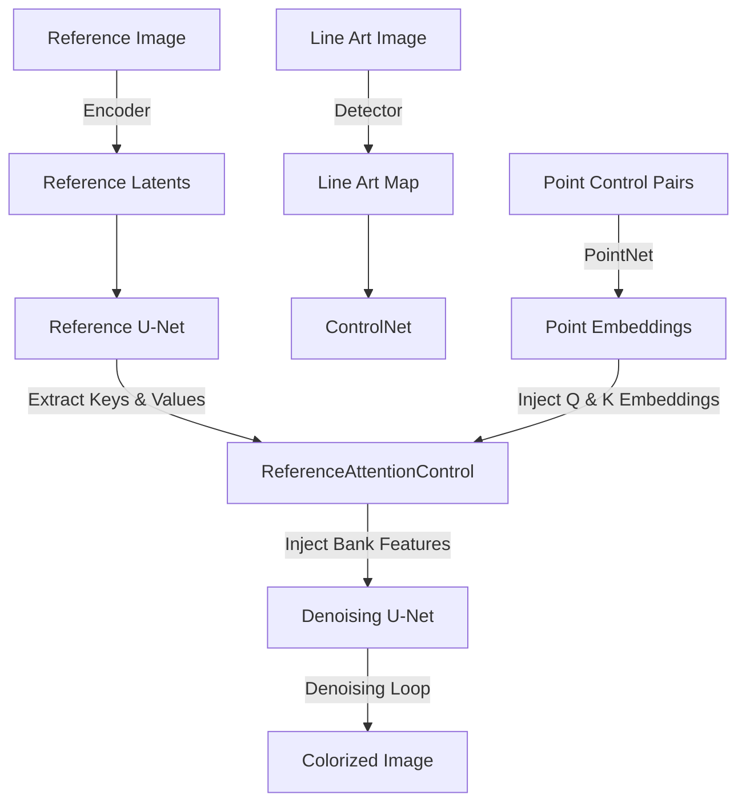

# MangaNinja Full Explanation (Merged)

---

## model_explanation.md

# MangaNinja: Model Explanation & Code Mapping

This document provides a brief explanation of how the **MangaNinja** model works based on the paper [2501.08332v1.pdf](file:///home/iismtl519-6895/2026summer/MangaNinjia/docs/2501.08332v1.pdf), and maps its core algorithmic components to the corresponding files and classes in this repository.

---

## 1. How the Model Works

**MangaNinja** is a reference-based line art colorization method designed to colorize a target line art image consistently with a reference color image. It addresses the issues of semantic mismatch and loss of fine-grained control present in existing approaches by introducing three key designs:

1. **Dual-Branch Attention Control (Reference U-Net & Denoising U-Net):**
   * Instead of passing reference features via standard text-cross-attention or style projections, MangaNinjia uses two parallel U-Nets:
     * **Reference U-Net:** Extracts multi-level style and semantic features from the reference image.
     * **Denoising U-Net:** Synthesizes the target colorized image starting from noisy target latents concatenated with the line art.
   * Features (keys and values) from the self-attention blocks of the Reference U-Net are injected into the self-attention blocks of the Denoising U-Net to ensure consistent style and semantic transfer.
2. **Progressive Patch Shuffling (Training Only):**
   * To prevent the model from learning a trivial global identity mapping and force it to establish local semantic correspondences, the reference image is split into small patches and shuffled randomly during training (progressing from $2 \times 2$ to $32 \times 32$ patches). This compels the U-Net's attention mechanism to perform local, pixel-level matching.
3. **Fine-Grained Point Control (via PointNet):**
   * When automatic matching is insufficient (e.g., extreme poses or complex scenes), users can define matching coordinate point pairs $(P_{ref}, P_{line})$ between the reference and the line art.
   * These points are encoded into spatial point embedding maps using a dedicated point network (**PointNet**).
   * The point embeddings $E_{ref}$ and $E_{tar}$ are added to the self-attention queries ($Q_{tar}$) and keys ($K_{tar}, K_{ref}$) in the cross-attention layer to guide colorization precisely.
4. **Multi Classifier-Free Guidance (CFG):**
   * Controls the reference image influence ($\omega_{ref}$) and point control influence ($\omega_{points}$) independently during generation using:
     $$\epsilon_\theta(z_t, c_{ref}, c_{points}) = \epsilon_\theta(z_t, \emptyset, \emptyset) + \omega_{ref} (\epsilon_\theta(z_t, c_{ref}, \emptyset) - \epsilon_\theta(z_t, \emptyset, \emptyset)) + \omega_{points} (\epsilon_\theta(z_t, c_{ref}, c_{points}) - \epsilon_\theta(z_t, c_{ref}, \emptyset))$$
---

## 2. Code Mapping & Implementation Details

Below is the mapping of each paper concept to the concrete implementation within the codebase:

### A. Point-Driven Control & Point Embedding
* **Paper Concept:** A network to encode spatial point coordinate maps into multi-scale sequence embeddings ($E_{ref}$ and $E_{tar}$).
* **Code Implementation:**
  * Class: [PointNet](file:///home/iismtl519-6895/2026summer/MangaNinjia/src/point_network.py#L6) in [point_network.py](file:///home/iismtl519-6895/2026summer/MangaNinjia/src/point_network.py)
  * **Details:** It takes a single-channel point coordinates matrix, passes it through convolutional blocks downsampled sequentially by factors of `[6, 2, 2, 2]`, and flattens/transposes the outputs into sequential embeddings matching the scale sizes of the U-Net features.

### B. Dual-Branch Reference Hooking & Feature Concatenation
* **Paper Concept:** Injecting reference keys and values into the denoising branch, and adding point embeddings to queries/keys for guided attention:
  $$\text{Attn} = \text{softmax}\left(\frac{Q'_{tar} [K'_{tar}, K'_{ref}]^\top}{\sqrt{d}}\right)[V_{tar}, V_{ref}]$$
* **Code Implementation:**
  * Class: [ReferenceAttentionControl](file:///home/iismtl519-6895/2026summer/MangaNinjia/src/models/mutual_self_attention_multi_scale.py#L22) in [mutual_self_attention_multi_scale.py](file:///home/iismtl519-6895/2026summer/MangaNinjia/src/models/mutual_self_attention_multi_scale.py)
  * Function: [hacked_basic_transformer_inner_forward](file:///home/iismtl519-6895/2026summer/MangaNinjia/src/models/mutual_self_attention_multi_scale.py#L96)
  * **Details:**
    * During the Reference U‑Net forward pass (`MODE == "write"`), its normalized hidden states are cloned and stored in a list called `bank`. These hidden states become **reference keys (K_ref) and values (V_ref)**. The reference branch does **not** generate a query tensor because the attention query is derived solely from the target (denoising) latent; the reference supplies context via keys/values only.
    * During the Denoising U‑Net forward pass (`MODE == "read"`), the cached reference features (`bank_fea`) are **concatenated** to the denoising hidden states, merging the reference K_ref/V_ref with the target tensors.
    * Point embeddings $E_{tar}$ and $E_{ref}$ (`point_bank_main` and `point_bank_ref`) are **added** to the query and key tensors of the target branch before the attention call `attn1`. The reference branch supplies only keys/values, not queries.
    * The CLIP image encoder (`refnet_image_encoder` and `controlnet_image_encoder`) in `MangaNinjiaPipeline.__call__` (see lines ~94‑104 of `inference/manganinjia_pipeline.py`) processes the reference image into CLIP image embeddings (`refnet_encoder_hidden_states`). These embeddings are passed as `encoder_hidden_states` to the Reference U‑Net, forming the source of K_ref and V_ref used above.

### C. Custom Attention Processor
* **Paper Concept:** Computing attention with distinct key and value tensors (since values do not contain point embeddings).
* **Code Implementation:**
  * Class: [AttnProcessor2_0](file:///home/iismtl519-6895/2026summer/MangaNinjia/src/models/attention_processor.py#L1215) in [attention_processor.py](file:///home/iismtl519-6895/2026summer/MangaNinjia/src/models/attention_processor.py)
  * **Details:** The processor accepts `encoder_hidden_states_v`. When it is provided, `key` is projected from `encoder_hidden_states` (which has point embeddings) and `value` is projected from `encoder_hidden_states_v` (which does not have point embeddings).

### D. Inference Pipeline & Guidance Control
* **Paper Concept:** Denoising loop scheduler and multi-classifier-free guidance formulation.
* **Code Implementation:**
  * Class: [MangaNinjiaPipeline](file:///home/iismtl519-6895/2026summer/MangaNinjia/inference/manganinjia_pipeline.py#L33) in [manganinjia_pipeline.py](file:///home/iismtl519-6895/2026summer/MangaNinjia/inference/manganinjia_pipeline.py)
  * **Details:**
    * In the denoising loop of `single_infer()`, `noise_pred` is chunked into three parts (`noise_pred_uncond`, `noise_pred_ref`, `noise_pred_point`).
    * The multi-guidance math combines these three chunks based on `guidance_scale_ref` and `guidance_scale_point` to produce the final step prediction.
---

## 3. End-to-End Inference Flow

1. **Configurations Loading:** Model paths and options are read from [inference.yaml](file:///home/iismtl519-6895/2026summer/MangaNinjia/configs/inference.yaml).
2. **Model Instantiation:** CLI scripts ([infer.py](file:///home/iismtl519-6895/2026summer/MangaNinjia/infer.py)) or Gradio interfaces ([run_gradio.py](file:///home/iismtl519-6895/2026summer/MangaNinjia/run_gradio.py)) load model weights for Reference U‑Net, Denoising U‑Net, ControlNet, VAE, CLIP Image Encoders, and PointNet.
3. **Pipeline Invocation:** The pipeline computes the point embeddings via `PointNet` and initializes [ReferenceAttentionControl](file:///home/iismtl519-6895/2026summer/MangaNinjia/src/models/mutual_self_attention_multi_scale.py#L22) hooks.
4. **Diffusion Denoising:** In each step, the reference features are cached in U‑Net's attention layer, combined with point guidance embeddings, and processed by the denoising branch to output the final colorized line art image.
---

---

## mutual_self_attention_explanation.md

# Code Explanation: `src/models/mutual_self_attention_multi_scale.py`

This document provides a section-by-section explanation of the implementation details for [mutual_self_attention_multi_scale.py](file:///home/iismtl519-6895/2026summer/MangaNinjia/src/models/mutual_self_attention_multi_scale.py), with a deep dive into how reference features are concatenated to the denoising branch.

---

## 1. Helper Functions

The file begins with two utility functions that assist in traversing PyTorch modules and filtering data.

### 1. `torch_dfs(model)`
```python
def torch_dfs(model: torch.nn.Module):
    result = [model]
    for child in model.children():
        result += torch_dfs(child)
    return result
```
* **Purpose**: Performs a Depth-First Search (DFS) traversal of a given PyTorch `nn.Module`.
* **Details**: It recursively collects the module and all its submodules (nested children) into a flat Python list. This is used later to locate and intercept attention layers inside the U‑Net.

### 2. `filter_matrices_by_size(matrix_list, reference_matrix)`
```python
def filter_matrices_by_size(matrix_list, reference_matrix):
    ref_shape = reference_matrix.shape[-2:]
    return [matrix for matrix in matrix_list if matrix.shape[-2:] == ref_shape]
```
* **Purpose**: Filters a list of point embedding matrices to find those that match the spatial dimensions of a reference matrix.
* **Details**: The spatial dimension of attention features varies across different resolution blocks of the U‑Net (e.g., $64 \times 64$, $32 \times 32$, $16 \times 16$). This function ensures that the multi‑scale point embedding maps generated by the PointNet are matched with the correct U‑Net attention blocks of the corresponding scale.

---

## 2. Class Initialization & Hook Registration

The class `ReferenceAttentionControl` coordinates feature sharing and point guidance injection.

### 1. `__init__`
```python
class ReferenceAttentionControl:
    def __init__(
        self,
        unet,
        mode="write",
        do_classifier_free_guidance=False,
        ...
    ) -> None:
        self.unet = unet
        assert mode in ["read", "write"]
        ...
        self.register_reference_hooks(
            mode,
            do_classifier_free_guidance,
            attention_auto_machine_weight,
            gn_auto_machine_weight,
            style_fidelity,
            reference_attn,
            reference_adain,
            fusion_blocks,
            batch_size=batch_size,
        )
        self.point_embedding=[]
```
* **Purpose**: Initializes the controller for a U‑Net instance.
* **Details:**
  * `mode="write"` designates this U‑Net as the **Reference U‑Net** (responsible for caching style and structure features from the reference image).
  * `mode="read"` designates this U‑Net as the **Denoising U‑Net** (which reads cached reference features and processes point guidance).
  * It immediately calls `register_reference_hooks` to modify the U‑Net blocks.

### 2. `register_reference_hooks`
* **Purpose**: Prepares the classifier‑free guidance masks (`uc_mask`) and identifies which blocks to target.
* **Targeting Blocks**:
  * If `fusion_blocks == "midup"`, only self‑attention blocks in the middle (`mid_block`) and up‑sampling (`up_blocks`) stages of the U‑Net are modified.
  * If `fusion_blocks == "full"`, all self‑attention blocks in the entire U‑Net are targeted.
* **Monkey Patching**:
  It iterates over the targeted `BasicTransformerBlock` modules and dynamically replaces their original forward method with `hacked_basic_transformer_inner_forward`:
  ```python
  module._original_inner_forward = module.forward
  module.forward = hacked_basic_transformer_inner_forward.__get__(
      module, BasicTransformerBlock
  )
  ```
  It also initializes empty lists on the module to hold cached features (`module.bank`) and point embeddings (`module.point_bank_ref`, `module.point_bank_main`).

---

## 3. Deep Dive: How the Attention Fusions & Concatenations Work

Here, we map the paper's mathematical statements directly to the code implementation.

### A. The Paper's Mathematical Formulation
In Section 3.2 of the paper, the fused self‑attention is described as:

$$\text{Attn}(Q_{tar}, K_{tar}, K_{ref}, V_{ref}, V_{tar}) = \text{softmax}\left(\frac{Q'_{tar} [K'_{tar}, K'_{ref}]^\top}{\sqrt{d}}\right)[V_{tar}, V_{ref}]$$

Where:
* $Q'_{tar} = Q_{tar} + E_{tar}$ (Target Query + Target Point Embedding)
* $K'_{tar} = K_{tar} + E_{tar}$ (Target Key + Target Point Embedding)
* $K'_{ref} = K_{ref} + E_{ref}$ (Reference Key + Reference Point Embedding)
* $[K'_{tar}, K'_{ref}]$ is the concatenation of the Target and Reference Keys along the sequence (token) dimension.
* $[V_{tar}, V_{ref}]$ is the concatenation of the Target and Reference Values along the sequence dimension (without Point Embeddings).

---

### B. Step-by-Step Code Flow

#### Step 1: Feature Caching in Reference U‑Net (`MODE == "write"`)
During the forward pass of the **Reference U‑Net**, the features are intercepted and appended to the cache:
```python
if MODE == "write":
    self.bank.append(norm_hidden_states.clone())
```
* **Shape of `norm_hidden_states`**: `(Batch, SequenceLength, Channels)`. For a $512 \times 512$ image at a $32 \times 32$ spatial feature scale, the shape is `(Batch, 1024, Channels)`.
* This cache `bank` now represents the reference features ($K_{ref}$ and $V_{ref}$).

#### Step 2: State Synchronization (`update` function)
The diffusion pipeline calls `update` to copy the cached layers from the reference U‑Net to the denoising U‑Net:
```python
for r, w in zip(reader_attn_modules, writer_attn_modules):
    r.bank = [v.clone().to(dtype) for v in w.bank]
```

#### Step 3: Sequence Concatenation in Denoising U‑Net (`MODE == "read"`)
During the forward pass of the **Denoising U‑Net**, the layer's local target features (`norm_hidden_states` representing $Q_{tar}$, $K_{tar}$, $V_{tar}$) are fused with the reference features (`bank_fea` representing $K_{ref}$, $V_{ref}$).

First, point embeddings are added to queries/keys, and target and reference tensors are concatenated along sequence dimension `dim=1`:
```python
# 1. Add point embeddings and concatenate to construct Keys
modify_norm_hidden_states = torch.cat(
    [norm_hidden_states + self.point_bank_main[0].repeat(norm_hidden_states.shape[0],1,1)] + 
    [bank_fea[0] + self.point_bank_ref[0].repeat(norm_hidden_states.shape[0],1,1)],
    dim=1
)

# 2. Concatenate raw target and reference features to construct Values
modify_norm_hidden_states_v = torch.cat(
    [norm_hidden_states] + bank_fea, 
    dim=1
)
```

#### Understanding Tensor Shapes:
Assume the current block features are at resolution $32 \times 32$:
* `norm_hidden_states` (Target features): Shape `(B, 1024, C)`
* `bank_fea[0]` (Reference features): Shape `(B, 1024, C)`
* `self.point_bank_main[0]` (Target point embeddings): Shape `(1, 1024, C)`
* `self.point_bank_ref[0]` (Reference point embeddings): Shape `(1, 1024, C)`

When we compute `modify_norm_hidden_states`:
1. `norm_hidden_states + point_bank_main` yields shape `(B, 1024, C)`.
2. `bank_fea[0] + point_bank_ref` yields shape `(B, 1024, C)`.
3. Concatenating them along `dim=1` creates a tensor of shape **`(B, 2048, C)`**. This represents $[K'_{tar}, K'_{ref}]$.

When we compute `modify_norm_hidden_states_v`:
1. Concatenating `norm_hidden_states` `(B, 1024, C)` and `bank_fea` `(B, 1024, C)` along `dim=1` creates a tensor of shape **`(B, 2048, C)`**. This represents $[V_{tar}, V_{ref}]$.

#### Step 4: The Custom Attention Call
The attention processor takes these concatenated inputs:
```python
self.attn1(
    norm_hidden_states + self.point_bank_main[0].repeat(norm_hidden_states.shape[0],1,1), # Query Q'
    encoder_hidden_states=modify_norm_hidden_states,                                     # Keys K'
    encoder_hidden_states_v=modify_norm_hidden_states_v,                                   # Values V
    attention_mask=attention_mask,
)
```
Inside the custom [AttnProcessor2_0](file:///home/iismtl519-6895/2026summer/MangaNinjia/src/models/attention_processor.py#L1215):
1. **Query Projection ($Q'$)**: Projected from `norm_hidden_states + point_embedding` (Shape `(B, 1024, C)`).
2. **Key Projection ($K'$)**: Projected from `encoder_hidden_states` (Shape `(B, 2048, C)`).
3. **Value Projection ($V$)**: Projected from `encoder_hidden_states_v` (Shape `(B, 2048, C)`).

The attention weights matrix is calculated as:
$$\text{Attention Map} = \text{softmax}\left(\frac{Q' {K'}^\top}{\sqrt{d}}\right)$$
* Shape: **`(B, Heads, 1024, 2048)`**

This map is then multiplied by the Value projection:
$$\text{Output} = \text{Attention Map} \times V$$
* Shape: **`(B, Heads, 1024, HeadDim)`**, which is reshaped back to **`(B, 1024, C)`**.

> [!TIP]
> Through this attention calculation, every token (spatial patch) in the target line art (length 1024) computes an attention score against *both* itself (first 1024 indices) and all tokens in the reference image (last 1024 indices). This allows the Denoising U‑Net to search the reference image patches for matching styles/colors.

---

## 4. Classifier-Free Guidance (CFG) Splitting

When CFG is enabled, the latent batch size is tripled to compute:
1. Unconditional generation (Target only, no reference or points).
2. Reference‑guided generation (Target + Reference style, no points).
3. Point‑guided generation (Target + Reference style + Point control).

To calculate these separately, the hacked forward pass uses boolean masks to override the inputs to `attn1`:
* **Unconditional Sub‑Batch (`_uc_mask`)**: Uses only target states for both keys and values (simulating a standard self‑attention block):
  ```python
  self.attn1(
      norm_hidden_states[_uc_mask],
      encoder_hidden_states=norm_hidden_states[_uc_mask],
  )
  ```
* **Reference‑Guided Sub‑Batch (`_uc_mask_2`)**: Concatenates target and reference features, but **without** adding point embedding offsets to queries or keys:
  ```python
  modify_norm_hidden_states = torch.cat([norm_hidden_states] + bank_fea, dim=1)
  self.attn1(
      norm_hidden_states[_uc_mask_2],
      encoder_hidden_states=modify_norm_hidden_states[_uc_mask_2],
  )
  ```
* **Point‑Guided Sub‑Batch**: Employs the full equation (including point embeddings added to queries and keys), as described in Section 3 above.

---

## 5. Lifetime Management (`update` and `clear`)

These functions manage state sharing and memory cleanup between steps of the diffusion scheduler loop.

### 1. `update`
```python
def update(self, writer, point_embedding_ref=None, point_embedding_main=None, dtype=torch.float16):
    ...
    for r, w in zip(reader_attn_modules, writer_attn_modules):
        r.bank = [v.clone().to(dtype) for v in w.bank]
        if point_embedding_main is not None:
            r.point_bank_ref = filter_matrices_by_size(point_embedding_ref, r.bank[0])
            r.point_bank_main = filter_matrices_by_size(point_embedding_main, r.bank[0])
```
* **Purpose**: Copies cached reference features from the writer's bank to the reader's bank, and assigns point embeddings of matching spatial sizes.

### 2. `clear`
```python
def clear(self):
    ...
    for r in reader_attn_modules:
        r.bank.clear()
        r.point_bank_ref.clear()
        r.point_bank_main.clear()
```
* **Purpose**: Clears all lists to free GPU memory and prepare for the next denoising step.
---

---

## patch_shuffle_mapping.md

# MangaNinja Code Mapping: Paper Concepts & Codebase Implementation

This document provides a detailed mapping between the algorithmic concepts described in the paper [2501.08332v1.pdf](file:///home/iismtl519-6895/2026summer/MangaNinjia/docs/2501.08332v1.pdf) ("MangaNinja: Line Art Colorization with Precise Reference Following") and their implementation in the MangaNinjia codebase.

---

## 1. Algorithmic Concepts & Implementation Mapping

The table below lists each key technique proposed in the paper and matches it to the corresponding implementation in the repository.

| Paper Concept | Description | Code Location & Implementation Details |
| :--- | :--- | :--- |
| **Dual-Branch Attention Control** | Cross-attention based feature injection from the Reference U‑Net to the Denoising U‑Net. | - Class: [ReferenceAttentionControl](file:///home/iismtl519-6895/2026summer/MangaNinjia/src/models/mutual_self_attention_multi_scale.py#L22) in [mutual_self_attention_multi_scale.py](file:///home/iismtl519-6895/2026summer/MangaNinjia/src/models/mutual_self_attention_multi_scale.py)<br>- Function: [hacked_basic_transformer_inner_forward](file:///home/iismtl519-6895/2026summer/MangaNinjia/src/models/mutual_self_attention_multi_scale.py#L96)<br>- **Details**: Caches features in `MODE == "write"` (Reference U‑Net) and concatenates/reads them in `MODE == "read"` (Denoising U‑Net). |
| **Fine‑Grained Point Control (PointNet)** | Network encoding sparse coordinate point matches into multi‑scale sequence embeddings ($E_{ref}$ and $E_{tar}$). | - Class: [PointNet](file:///home/iismtl519-6895/2026summer/MangaNinjia/src/point_network.py#L6) in [point_network.py](file:///home/iismtl519-6895/2026summer/MangaNinjia/src/point_network.py)<br>- **Details**: Downsamples single-channel point coordinate maps via conv‑blocks and flattens/transposes them to match the spatial dimensions of the U‑Net layers. |
| **Separated Key & Value Attn Processor** | Computing attention weights using queries and keys enriched with point embeddings, while using values *without* point embeddings. | - Class: [AttnProcessor2_0](file:///home/iismtl519-6895/2026summer/MangaNinjia/src/models/attention_processor.py#L1215) in [attention_processor.py](file:///home/iismtl519-6895/2026summer/MangaNinjia/src/models/attention_processor.py)<br>- **Details**: Accepts `encoder_hidden_states_v` to construct separate key (from `encoder_hidden_states` containing point embeddings) and value (from `encoder_hidden_states_v` containing only style/content) projections. |
| **Multi Classifier-Free Guidance (CFG)** | Denoising loop scheduler combining unconditional, reference‑guided, and point‑guided predictions. | - Class: [MangaNinjiaPipeline](file:///home/iismtl519-6895/2026summer/MangaNinjia/inference/manganinjia_pipeline.py#L33) in [manganinjia_pipeline.py](file:///home/iismtl519-6895/2026summer/MangaNinjia/inference/manganinjia_pipeline.py)<br>- **Details**: The denoising loop in `single_infer()` chunks `noise_pred` into `noise_pred_uncond`, `noise_pred_ref`, and `noise_pred_point`, scaling them by `guidance_scale_ref` and `guidance_scale_point`. |
| **Progressive Patch Shuffling** | Shuffling reference image patches (from $2 \times 2$ to $32 \times 32$) to force local/pixel-level semantic matching. | - **Training‑Only Strategy** (Not in inference codebase).<br>- **Details**: Since this repository is the **official inference‑only release** (designed for executing the model and running the Gradio interface), the training data loader and training loops are omitted. Thus, there is no active code implementing the patch shuffling transformation. However, its effects are directly embedded in the pretrained weights. |

---

## 2. Deep Dive: "Patch Shuffle" (Section 3.2 of the Paper)

### What is Progressive Patch Shuffling?
In reference‑guided line art colorization, U‑Net attention blocks naturally tend to match features globally (i.e. copying global style/color distribution) rather than learning precise local correspondences.

To overcome this "comfort zone", the authors proposed **Progressive Patch Shuffling**:
1. The reference image is split into small patches.
2. The patches are randomly shuffled to destroy the overall structure and global coherence while preserving local texture/color.
3. During training, the resolution of shuffling is progressively increased from coarse ($2 \times 2$) to fine ($32 \times 32$) patches.

> [!NOTE]
> This forces the dual‑branch U‑Net's attention mechanism to perform local, pixel‑level matching to align the reference textures to the target line art.

### Implementation Status in the Codebase
Because this repository is an **inference‑only release** (see the [README.md](file:///home/iismtl519-6895/2026summer/MangaNinjia/README.md) announcement on 2025-01-15: *"Inference code and paper are released"*):
* **No PyTorch training scripts** or **dataset loading scripts** (where the random patch division and shuffling takes place) are included in this codebase.
* Consequently, you will not find a `patch_shuffle()` or `shuffle_patches()` function in the current files.
* However, the **trained weights** (`denoising_unet.pth` and `reference_unet.pth`) were optimized using this strategy. The attention weights in [ReferenceAttentionControl](file:///home/iismtl519-6895/2026summer/MangaNinjia/src/models/mutual_self_attention_multi_scale.py#L22) are therefore fully capable of local semantic alignment, which is what enables point control to work correctly.

---

## 3. How the Core Modules Cooperate during Inference

The diagram below shows the flow of features and how the different components in the codebase interact during a single denoising step:



### Key Files and Class References:
* **Point Embedding generation**: [PointNet.forward](file:///home/iismtl519-6895/2026summer/MangaNinjia/src/point_network.py#L27) downsamples point coordinates to shape $(B, C, H \times W)$ matching each layer's feature dimensions.
* **Feature Injection**: [hacked_basic_transformer_inner_forward](file:///home/iismtl519-6895/2026summer/MangaNinjia/src/models/mutual_self_attention_multi_scale.py#L96) intercepts the self‑attention block:
  * In `write` mode (Reference branch), features are stored in `bank`.
  * In `read` mode (Denoising branch), it concatenates target features with reference features (`modify_norm_hidden_states` and `modify_norm_hidden_states_v`), adding point embeddings to queries and keys.
* **Separated Key‑Value Attention**: [AttnProcessor2_0](file:///home/iismtl519-6895/2026summer/MangaNinjia/src/models/attention_processor.py#L1215) calculates:
  $$\text{Attn}(Q'_{tar}, K'_{tar}, K'_{ref}, V_{tar}, V_{ref})$$
  separately, applying point‑guidance projections only to $Q$ and $K$ while keeping $V$ clean.

---

*End of merged documentation.*
